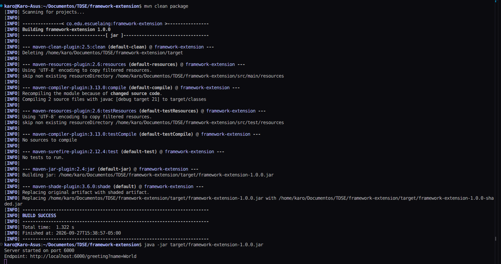
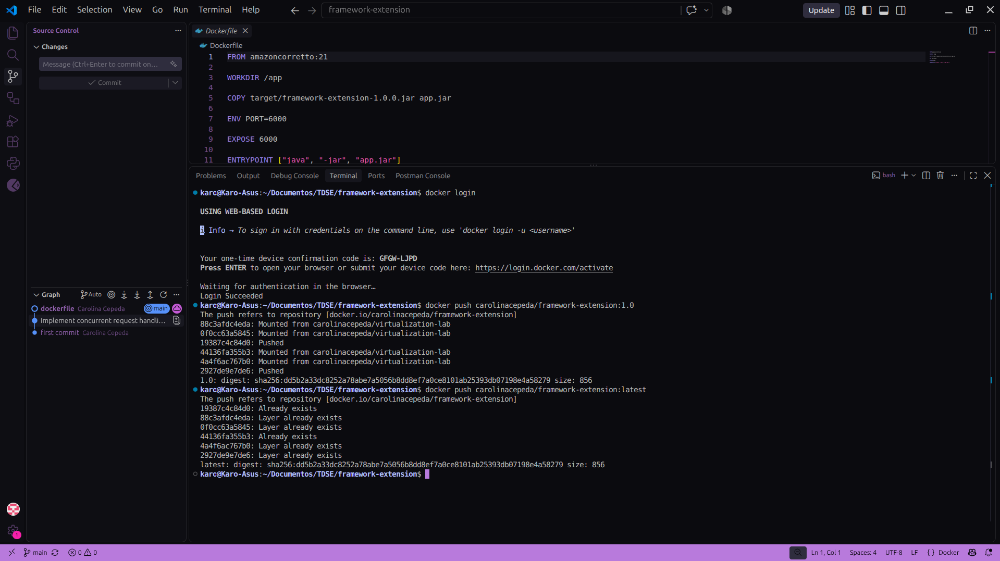
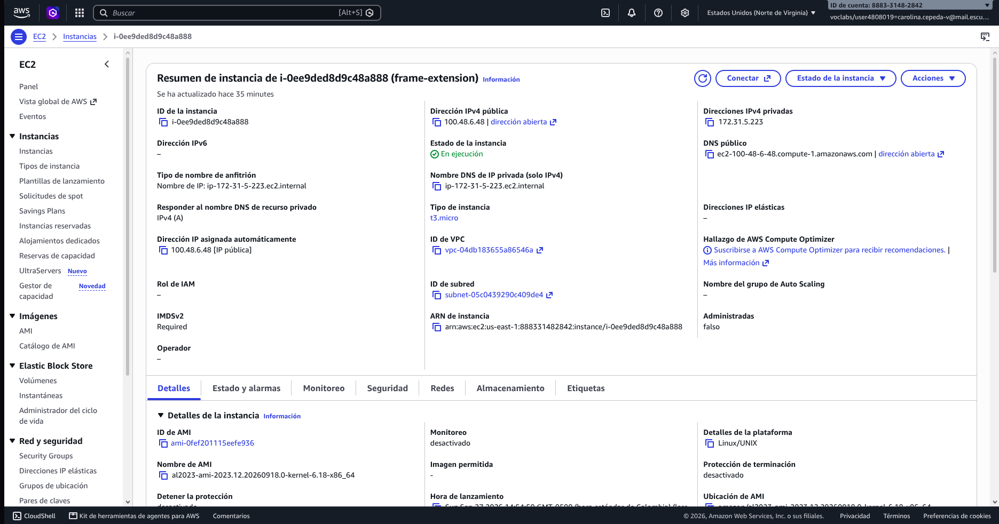
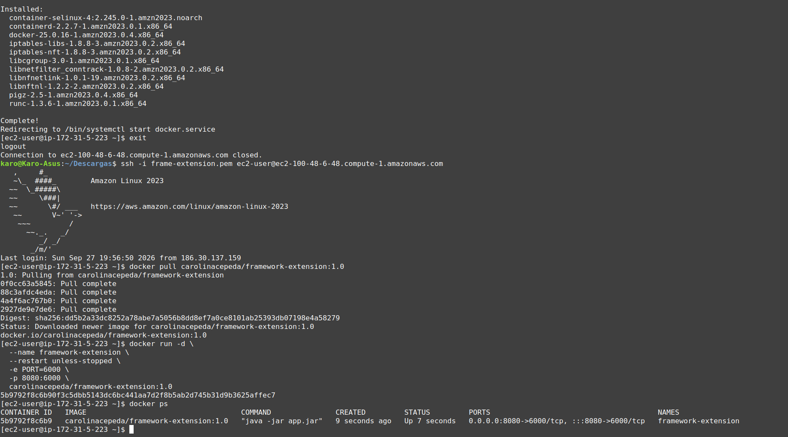
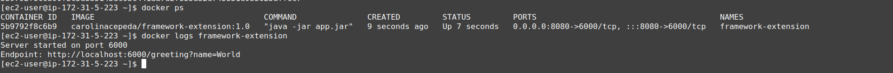
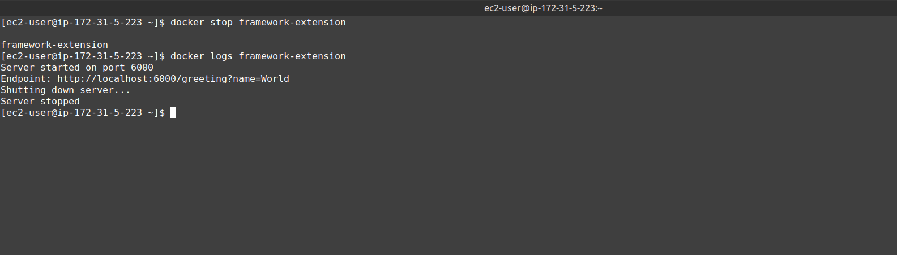
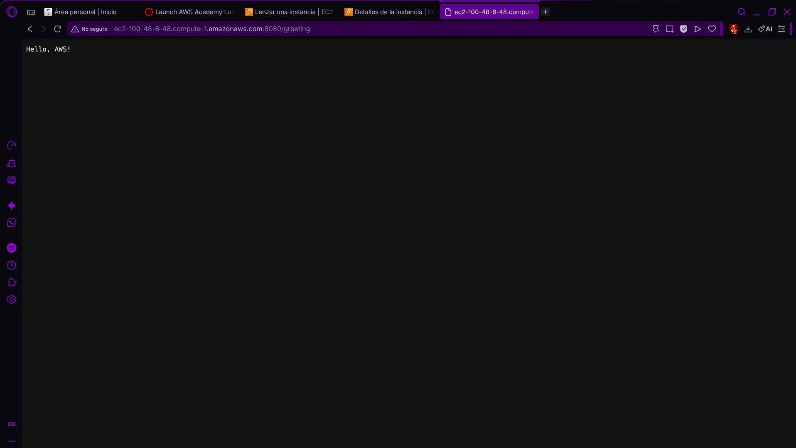

# Framework Extension: Custom HTTP Server


## Overview

This repository contains a **minimal HTTP framework built from scratch** using Java's built-in `com.sun.net.httpserver` package. 

The framework has:
- Concurrent request handling via thread pool
- Graceful shutdown with request draining
- Environment-based port configuration
- Docker containerization
- AWS EC2 deployment

---

## Architecture

```
┌─────────────────────────────────────────────────────────────────────┐
│                           Client                                    │
│                              │                                      │
│                              ▼ HTTP                                 │
│  ┌─────────────────────────────────────────────────────────────┐   │
│  │                    AWS EC2 Instance                         │   │
│  │  ┌─────────────────────────────────────────────────────┐   │   │
│  │  │                 Security Group                      │   │   │
│  │  │  • SSH (22)                                         │   │   │
│  │  │  • HTTP (8080)                                      │   │   │
│  │  └─────────────────────────────────────────────────────┘   │   │
│  │                              │                              │   │
│  │                              ▼                              │   │
│  │  ┌─────────────────────────────────────────────────────┐   │   │
│  │  │                   Docker Engine                     │   │   │
│  │  │                              │                      │   │   │
│  │  │                              ▼                      │   │   │
│  │  │  ┌─────────────────────────────────────────────┐   │   │   │
│  │  │  │           Custom HTTP Server Container      │   │   │   │
│  │  │  │  • Port: 6000 (mapped to 8080)              │   │   │   │
│  │  │  │  • Image: carolinacepeda/framework-extension│   │   │   │
│  │  │  │  • Thread Pool: 10 workers                  │   │   │   │
│  │  │  │  • Graceful shutdown on SIGTERM             │   │   │   │
│  │  │  └─────────────────────────────────────────────┘   │   │   │
│  │  └─────────────────────────────────────────────────────┘   │   │
│  └─────────────────────────────────────────────────────────────┘   │
└─────────────────────────────────────────────────────────────────────┘
```

---

## Technology Stack

| Component | Version |
|-----------|---------|
| Java | 21 LTS (Amazon Corretto) |
| HTTP Server | `com.sun.net.httpserver` (JDK built-in) |
| Concurrency | `java.util.concurrent.Executors` |
| Build | Maven 3.9+ with Shade Plugin |
| Container | Docker / Amazon Corretto 21 |
| Cloud | AWS EC2 (Amazon Linux 2023) |

---

## Project Structure

```
framework-extension/
├── src/
│   └── main/java/com/example/framework/
│       ├── MyServer.java          # HTTP server, thread pool, shutdown hook
│       └── GreetingHandler.java   # GET /greeting endpoint handler
├── target/
│   └── framework-extension-1.0.0.jar  # Fat JAR with all dependencies
├── docs/
│   └── imgs/
│       ├── ec2_docker_logs_framework.png
│       ├── ec2_framework_extension.png
│       ├── ec2_framework_instaceinfo.png
│       ├── ec2_helloaws.png
│       └── framework_extension_dockerpush.png
├── Dockerfile
├── pom.xml
├── .gitignore
└── README.md
```

---

## Features

### 1. Concurrent Request Handling
- Fixed thread pool of 10 workers (`Executors.newFixedThreadPool(10)`)
- Each request handled independently
- Tested with 20 concurrent requests

### 2. Graceful Shutdown
- JVM shutdown hook registered via `Runtime.addShutdownHook()`
- On SIGTERM (Docker stop):
  1. Stop accepting new connections (`server.stop(0)`)
  2. Wait up to 10 seconds for in-flight requests (`executor.awaitTermination()`)
  3. Force shutdown remaining tasks if timeout exceeded

### 3. Environment-Based Port Configuration
```java
int port = Integer.parseInt(System.getenv().getOrDefault("PORT", "6000"));
```
- Default: 6000
- Override: `PORT=7000 java -jar app.jar` or `docker run -e PORT=7000`

### 4. REST Endpoint
**GET** `/greeting?name={name}`

```bash
curl http://localhost:6000/greeting?name=Karo
# Response: Hello, Karo!

curl http://localhost:6000/greeting
# Response: Hello, World!
```

---

## How to Run

### Prerequisites
- Java 21+
- Maven 3.9+
- Docker
- Docker Hub account (for push)
- AWS Account (for EC2 deployment)

### Local Development (JAR)

```bash
# Build
mvn clean package

# Run (default port 6000)
java -jar target/framework-extension-1.0.0.jar

# Run (custom port)
PORT=7000 java -jar target/framework-extension-1.0.0.jar

# Test
curl http://localhost:6000/greeting?name=Test
```

### Docker

```bash
# Build image
docker build -t carolinacepeda/framework-extension:1.0 .

# Run container
docker run -d --name framework-extension -p 6000:6000 -e PORT=6000 carolinacepeda/framework-extension:1.0

# Test
curl http://localhost:6000/greeting?name=Docker

# Stop gracefully
docker stop framework-extension
```

### Use Published Image

```bash
docker pull carolinacepeda/framework-extension:1.0
docker run -d -p 8080:6000 -e PORT=6000 carolinacepeda/framework-extension:1.0
```

---

## Docker Hub

**Repository**: [carolinacepeda/framework-extension](https://hub.docker.com/r/carolinacepeda/framework-extension)

| Tag | Description |
|-----|-------------|
| `1.0` | Versioned release |
| `latest` | Latest build |

### Push Commands
```bash
docker login
docker tag carolinacepeda/framework-extension:1.0 carolinacepeda/framework-extension:latest
docker push carolinacepeda/framework-extension:1.0
docker push carolinacepeda/framework-extension:latest
```

---

## AWS EC2 Deployment

### 1. Launch EC2 Instance
- **AMI**: Amazon Linux 2023
- **Type**: t3.micro (Free Tier eligible)
- **Region**: us-east-1
- **Key Pair**: Create/download `.pem`
- **Security Group**:
  - SSH (22)
  - Custom TCP (8080) — Source:  0.0.0.0/0

### 2. Install Docker on EC2
```bash
ssh -i your-key.pem ec2-user@<ec2-public-dns>

sudo yum update -y
sudo yum install -y docker
sudo service docker start
sudo usermod -a -G docker ec2-user

# Log out and back in
exit
ssh -i your-key.pem ec2-user@<ec2-public-dns>
```

### 3. Deploy
```bash
docker pull carolinacepeda/framework-extension:1.0

docker run -d \
  --name framework-extension \
  --restart unless-stopped \
  -e PORT=6000 \
  -p 8080:6000 \
  carolinacepeda/framework-extension:1.0
```

### 4. Verify
```bash
docker ps
docker logs framework-extension

# External test
curl http://<ec2-public-dns>:8080/greeting?name=AWS
# Response: Hello, AWS!
```

### 5. Cleanup
```bash
# Terminate instance to avoid charges
# AWS Console → EC2 → Instances → Terminate
```

---

## Evidence

### Local Build & Test



### Docker Hub

**Docker Hub Push** - Both `1.0` and `latest` tags pushed:


### AWS EC2 Deployment

**EC2 Instance Info** - Running t3.micro in us-east-1:


**EC2 Framework Extension** - Docker container running on EC2:


**EC2 Docker Logs** - Graceful startup and shutdown logs:




**EC2 External Test** - Browser test from local machine:

